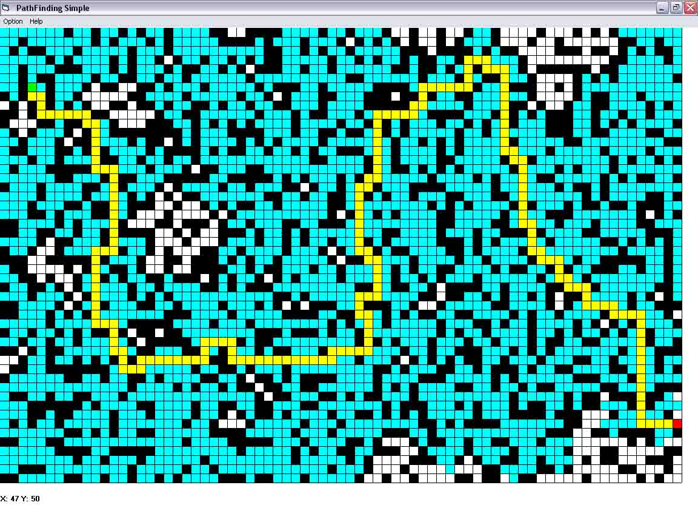



## \[PathFinding \-Simple way\]

### Description

This is a heavily commented pathfinding algorithm. It has a customizable map, you can generate the terrain randomly, and just put in start and end position. I decided to do this program because ive seen a lot of pathfinding tools out there that are simply too big and hard, while pathfinding in nature is pretty simple. Enjoy and vote
 
### More Info
 

             |
---                |---
**Submitted On**   |2004-07-20 23:53:26
**By**             |[Mephisto](https://github.com/Planet-Source-Code/PSCIndex/blob/master/ByAuthor/mephisto.md)
**Level**          |Intermediate
**User Rating**    |4.8 (19 globes from 4 users)
**Compatibility**  |VB 6\.0
**Category**       |[Coding Standards](https://github.com/Planet-Source-Code/PSCIndex/blob/master/ByCategory/coding-standards__1-43.md)
**World**          |[Visual Basic](https://github.com/Planet-Source-Code/PSCIndex/blob/master/ByWorld/visual-basic.md)
**Archive File**   |[\[PathFindi1772277212004\.zip](https://github.com/Planet-Source-Code/mephisto-pathfinding-simple-way__1-55075/archive/master.zip)

